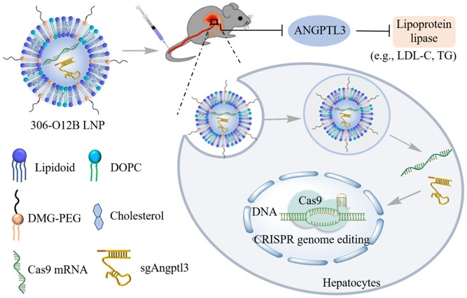

<head>
    <meta charset="UTF-8">
    <meta name="viewport" content="width=device-width, initial-scale=1.0">
    <title>Research Team</title>
    
</head>
<body>
    

        
        

            
We are dedicated to developing nucleic acid-based therapies, achieving this goal through the synthesis of lipid nanoparticles. Our research team, composed of passionate and innovative scientists, focuses on exploring cutting-edge biotechnology to advance medical progress. Whether it's RNA vaccines, gene therapy, or other nucleic acid drugs, we are constantly striving to contribute to improving human health. Visit our lab's homepage to learn more about our latest research developments and achievements.

        

    

</body>

---
<h1 style="font-size: 32px;">Highlight</h1>

<head>
    <meta charset="UTF-8">
    <meta name="viewport" content="width=device-width, initial-scale=1.0">
    <title>Image Gallery with Titles and Descriptions</title>
    
</head>
<body>
    

        

            
            

                <h5 class="image-title"><a href="https://www.pnas.org/doi/10.1073/pnas.2116271119">Lung-selective mRNA delivery of synthetic lipid nanoparticles for the treatment of pulmonary lymphangioleiomyomatosis</a></h5>
                

            

        

        

            
            

                <h5 class="image-title"><a href="https://www.pnas.org/doi/full/10.1073/pnas.2020401118">Lipid nanoparticle-mediated codelivery of Cas9 mRNA and single-guide RNA achieves liver-specific in vivo genome editing of Angptl3</a></h5>
                

            

        

        

            
            

                <h5 class="image-title"><a href="https://pubs.acs.org/doi/10.1021/acs.accounts.1c00500">Developing Biodegradable Lipid Nanoparticles for Intracellular mRNA Delivery and Genome Editing</a></h5>
                

            

        

    

</body>
